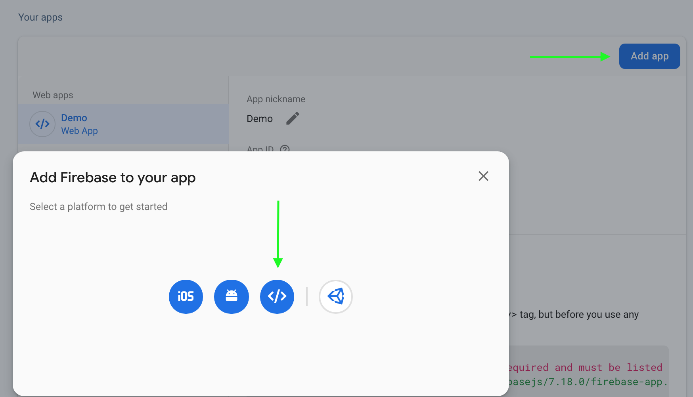
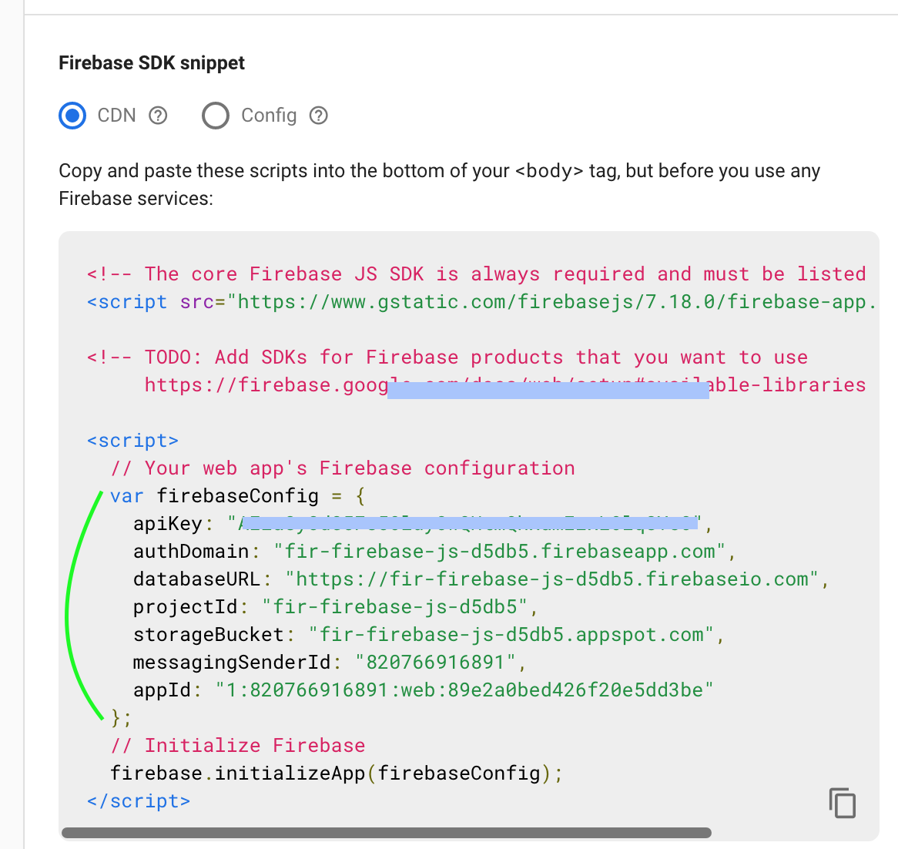
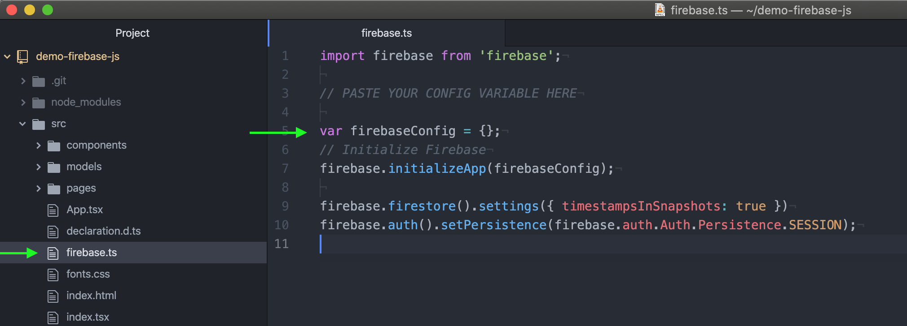
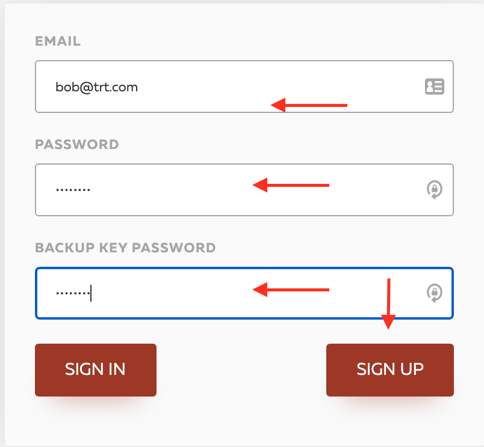
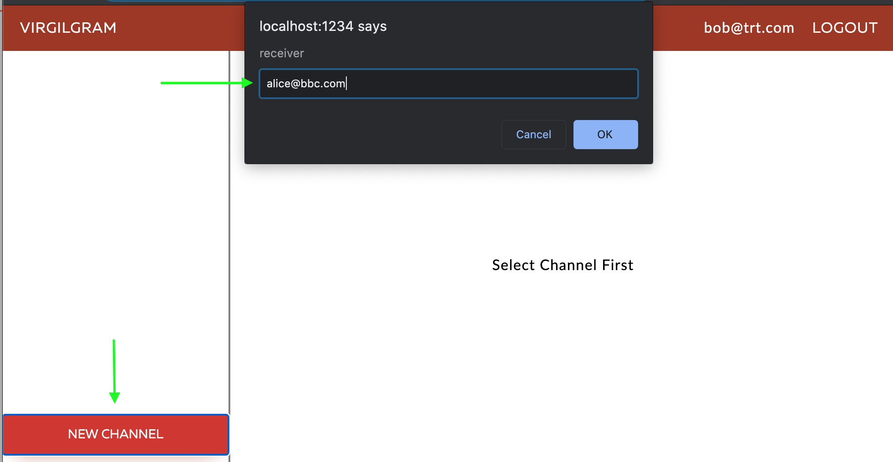

# Virgil E3Kit JS Web + Firebase Demo

<a href="https://developer.virgilsecurity.com/docs"></a> This is an end-to-end encrypted HIPAA-compliant demo chat app for Firebase that is using [Virgil Security](https://virgilsecurity.com)'s [E3Kit JavaScript SDK](https://github.com/VirgilSecurity/virgil-e3kit-js). The demo allows you to register users and back up their private keys, create peer-to-peer channels and send end-to-end encrypted messages.

You can reuse this sample in your projects to protect user data, documents, images using Virgil's end-to-end encryption [HIPAA whitepaper](https://virgilsecurity.com/wp-content/uploads/2018/07/Firebase-HIPAA-Chat-Whitepaper-Virgil-Security.pdf).

After you set up the demo with the all credentials required in the instructions below you can run a chat for chatting:


> The demo is using E3Kit v2.3.3.

## Prerequisites

* [Node v10](https://nodejs.org/en/download) or newer
* [npm](https://www.npmjs.com/get-npm) or [yarn](https://yarnpkg.com/)

## Set up and run demo

### Clone JavaScript project

```bash
git clone https://github.com/VirgilSecurity/demo-firebase-js
cd demo-firebase-js
```

### Connect your Virgil and Firebase accounts

To connect your Virgil and Firebase accounts, you need to deploy a Firebase function that gives out Virgil JWT tokens for your authenticated users.

To deploy the function, head over to our GitHub repo and follow the instructions in README:

* **[Firebase function deployment instructions](https://github.com/VirgilSecurity/e3kit-firebase-func)**

#### Configure Authentication

At Firebase dashboard, select the **Authentication** panel and then click the **Sign In Method** tab. Choose the **E-mail** authentication method and click **Done**, then follow instructions and click **Save**.


&nbsp;

#### Configure Cloud Firestore

Set up a Firestore database for the sample apps:
1. Select the **Cloud Firestore** panel
2. Click **Create database** under Firestore
3. Choose **Start in test mode** and click **Enable**

Once the database is created, click on the **Rules** tab, click **Edit rules** and paste:
  ```
  service cloud.firestore {
    match /databases/{database}/documents {
      match /{document=**} {
        allow read, write: if request.auth.uid != null;
      }
    }
  }
  ```
Now click **PUBLISH**.


&nbsp;
> You only need to do this once - if you had already done it earlier, you don't need to do it again.

### Add your Firebase project config to app

1. Go to the Firebase console -> your project's page in Firebase console, click the **gear icon** -> **Project settings**

&nbsp;

2. Click **Add app** and choose **"</> Add Firebase to your web app"**

&nbsp;

3. Copy **only this part** to the clipboard:
  ```
    var firebaseConfig = {
      apiKey: "...",
      authDomain: "...",
      databaseURL: "...",
      projectId: "...",
      storageBucket: "...",
      messagingSenderId: "..."
    };
  ```



&nbsp;

4. **Replace the copied block** in your `src/firebase.ts` file.


&nbsp;

### Build and run

* **Update dependencies, build & run**
  ```
  npm install
  npm run start
  ```

> In case you receive a message like `warning found n vulnerabilities` printed in the console after running the `npm install`, there is a potential security vulnerability in one of the demo's dependencies. Don't worry, this is a normal occurrence and in the majority of cases it is fixed by updating the packages. To install any updates, run the command `npm audit fix`. If some of the vulnerabilities persist after the update, check the results of the `npm audit` to see a detailed report. The report includes instructions on how to act on this information.

## Explore demo

1. **Browse to http://localhost:1234**. You will see a register/login form; you can use any e-mail and password to sign up a test user.



2. Start a **second incognito or browser window** to have 2 chat apps running with 2 different users. Sign up one more user.


3. Click the "New Channel" to create a channel between the 2 users.



&nbsp;
Now you can start sending encrypted messages between them.


> Remember, the app deletes messages right after delivery (it's a HIPAA requirement to meet the conduit exception). If you want to see encrypted messages in your Firestore database, run only 1 browser instance, send a message to your chat partner and check Firestore DB's contents before opening the other user's app to receive the message. If you don't want to implement this behavior in your own app, you can remove it from this sample [here](https://github.com/VirgilSecurity/demo-firebase-js/blob/d263f0ddd4f92f51ee2a925cdffd32a19a0387ae/src/models/MessageListModel.ts#L34).

## License

This library is released under the [3-clause BSD License](LICENSE).

## Support
Our developer support team is here to help you. Find out more information on our [Help Center](https://help.virgilsecurity.com/).

You can find us on [Twitter](https://twitter.com/VirgilSecurity) or send us email support@VirgilSecurity.com.

Also, get extra help from our support team on [Slack](https://virgilsecurity.com/join-community).
